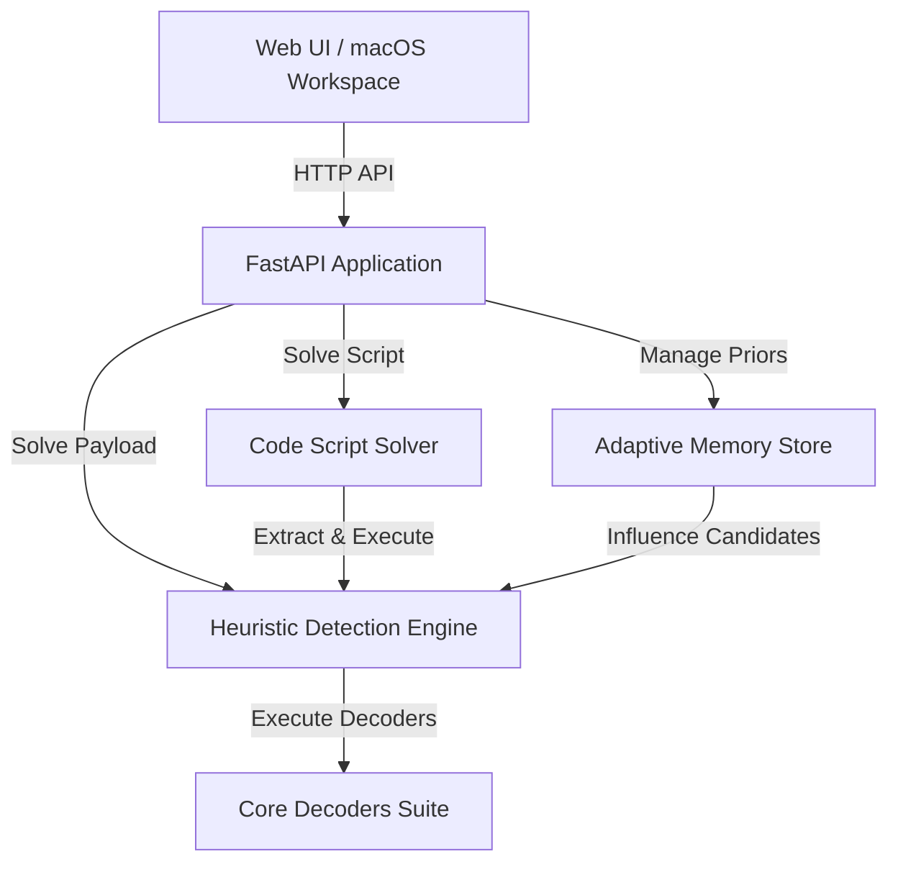

# 🚩 CTF Decoder — Capture The Flag Toolkit

A modular, extensible, and self-learning decoding suite built for competitive Capture The Flag challenges. Features automated cipher detection, dynamic code script solving, and a responsive macOS-style workspace.

---

## Table of Contents

- [Core Features](#core-features)
- [System Architecture](#system-architecture)
- [Adaptive Heuristic Engine](#adaptive-heuristic-engine)
- [Code Script Solver](#code-script-solver)
- [macOS Desktop Web Interface](#macos-desktop-web-interface)
- [Deployment on Vercel](#deployment-on-vercel)
- [Local Quick Start](#local-quick-start)
- [Running the Test Suite](#running-the-test-suite)

---

## Core Features

- **Self-Learning Auto-Detection** — Probabilistic classifier detects encoding types from raw bytes. Utilizes a Beta-Binomial update system to adaptively update success priors from user feedback.
- **Dynamic Code Script Solver** — Scans and solves source code files (Python, C/C++, Java). Statically extracts literal strings/arrays, executes code dynamically in a secure environment, and runs heuristics over output to uncover hidden flags.
- **Chained Decoding Paths** — Applies multiple transformations in sequence (e.g., `gzip | base64 | xor | rot13`) using best-first search options.
- **30+ Supported Decoders** — Fully supports Base64, Hex, ROT13, Base32, Base85, Binary, Octal, Morse, URL encoding, XOR ciphers (single/multi-byte), Zlib, Gzip, and Bzip2 compression.
- **macOS Desktop Workspace** — Beautiful glassmorphic UI equipped with live Sonoma/Sequoia style desktop widgets (Clock and live CTF Engine status monitor).

---

## System Architecture



The system is split into three main backend subsystems:
1. **`ctf_decoder/core`**: Contains the core encoder/decoder algorithms and the adaptive solver chaining logic.
2. **`ctf_decoder/detection`**: Houses the heuristic probability calculator and natural language verification models.
3. **`ctf_decoder/web`**: FastAPI application exposing endpoints and hosting the single-page application.

---

## Adaptive Heuristic Engine

When an encoded payload is submitted, the engine evaluates it against multiple decoder modules:
1. **Entropy & Structural Analysis**: Computes character distributions, Shannon entropy, valid byte-ranges, and structural patterns.
2. **Natural Language Evaluation**: Decoded candidate strings are scored based on printable ASCII ratios, bigram frequencies, English dictionary lookups, and regex patterns.
3. **Prior Feedback Integration**: Probabilities are weighted against historical codec success rates (priors) stored in the session memory.

---

## Code Script Solver

The **Code Script Solver** automates challenge scenarios where flags are dynamically compiled or embedded within scripting files:
- **Static Analysis**: Parses syntax trees to find hardcoded byte lists, hex variables, and raw string literals.
- **Dynamic Run Environment**: Safely runs scripts to intercept print streams and console logs.
- **Recursive Solver**: Feeds all extracted logs and string constants back into the decoding chain to catch obfuscated flags.

---

## macOS Desktop Web Interface

The web workspace features a dark glassmorphic macOS visual design:
- **Menu Bar**: Displays current system status and a live local digital clock.
- **Sonoma/Sequoia Desktop Widgets**: 
  - **Clock/Calendar Widget**: Features large-format time, AM/PM indicator, and date display.
  - **CTF Engine Widget**: Lists the count of learned priors and active target platform hints.
- **Workspaces**:
  - **Auto / Manual Decoders**: Main panel to run automatic, manual, or brute-force decoding. Shows real-time candidate scores and provides feedback buttons to reinforce or penalize model priors.
  - **Code Script Solver**: Editor to paste, configure, and execute source code scripts to extract flag structures.
  - **Adaptive Memory Store**: Dashboard showing session identifiers, recent solves, platform target analysis, and the Beta-Binomial success distributions table.

---

## Deployment on Vercel

The application is fully configured for serverless deployment on Vercel:
- **`vercel.json`**: Configures the FastAPI entrypoint redirecting API requests to the Python serverless environment.
- **`pyproject.toml`**: Specifies the deployment package metadata and entrypoint variable definition:
  ```toml
  [tool.vercel]
  entrypoint = "ctf_decoder.web.app:app"
  ```
- **Serverless Optimizations**: Database initialization routines gracefully fail-over to in-memory storage (`:memory:`) if the hosting environment's file system is read-only. Heavy scientific package imports (like NumPy) are loaded dynamically on demand to minimize serverless cold-start times.

---

## Local Quick Start

### 1. Install Dependencies
Ensure you have Python 3.10+ installed:
```bash
pip install -r requirements.txt
```

### 2. Launch the Web Interface
Start the local server using Uvicorn:
```bash
python -m uvicorn ctf_decoder.web.app:app --port 8000 --host 127.0.0.1
```
Open `http://127.0.0.1:8000` in your web browser.

---

## Running the Test Suite

Run the test suite to verify code solvers, decoders, and heuristic detection:
```bash
# Verify basic decoders
python test_decoders.py

# Verify code solver extraction and execution
python test_solver.py

# Verify API responses and route handlers
python test_api.py
```
